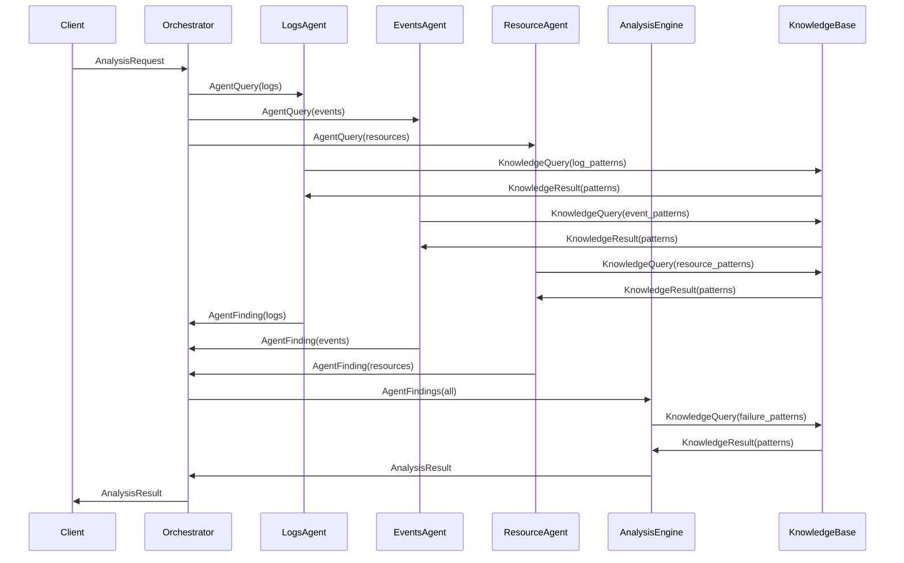
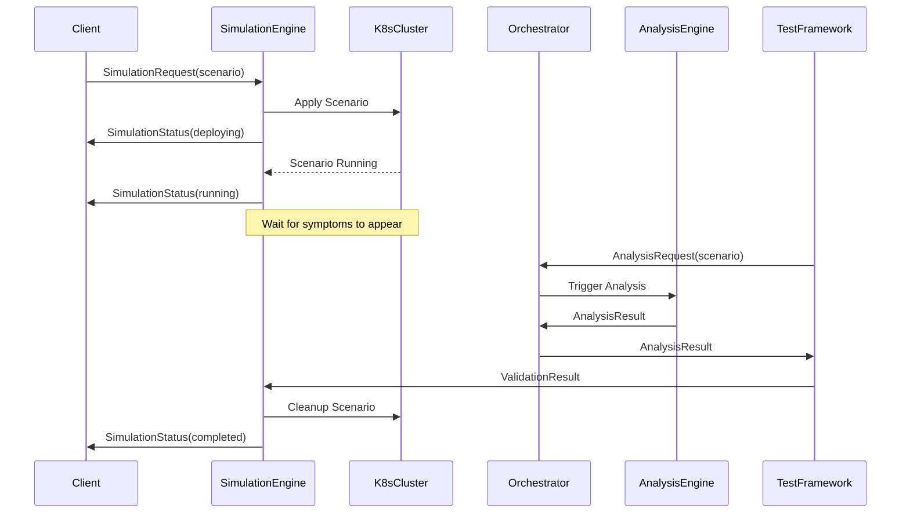
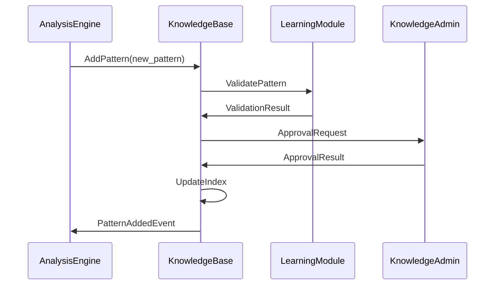
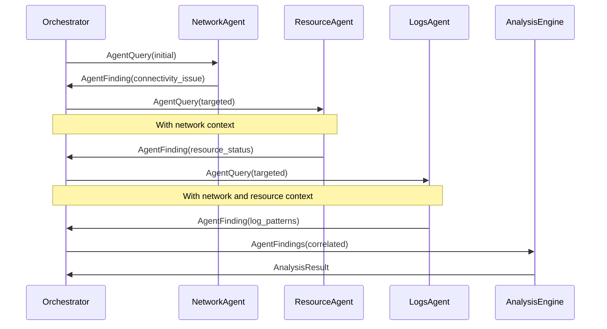

# Message Flow Documentation

This document describes the message flow between components in the Multi-Agent Root Cause Analysis System. It covers the key interactions, data exchange formats, and sequence of operations during various system workflows.

## Core Message Types

The system uses the following primary message types for inter-component communication:

1. **AnalysisRequest**: Initiates an analysis workflow
2. **AgentQuery**: Request for a specialist agent to perform analysis
3. **AgentFinding**: Results produced by specialist agents
4. **AnalysisResult**: Complete analysis output including root cause and recommendations
5. **SimulationRequest**: Command to deploy a simulation scenario
6. **SimulationStatus**: Status update from a running simulation
7. **KnowledgeQuery**: Request for information from the knowledge base
8. **KnowledgeResult**: Response containing knowledge base information
9. **SystemEvent**: Notification of state changes and important events

## Primary Message Flow Sequences

### 1. Root Cause Analysis Workflow



#### Message Details

1. **AnalysisRequest**:
   ```json
   {
     "request_id": "req-12345",
     "timestamp": "2023-03-30T15:30:00Z",
     "context": {
       "cluster": "production-west",
       "namespace": "retail-app",
       "reported_symptoms": "Service unavailable with 500 errors",
       "affected_components": ["order-service", "payment-db"],
       "time_range": {
         "start": "2023-03-30T14:00:00Z",
         "end": "2023-03-30T15:30:00Z"
       }
     },
     "options": {
       "priority": "high",
       "include_agents": ["logs", "events", "resources", "network"],
       "confidence_threshold": 70.0
     }
   }
   ```

2. **AgentQuery**:
   ```json
   {
     "query_id": "query-logs-54321",
     "agent_type": "logs",
     "request_id": "req-12345",
     "timestamp": "2023-03-30T15:30:05Z",
     "context": {
       "cluster": "production-west",
       "namespace": "retail-app",
       "time_range": {
         "start": "2023-03-30T14:00:00Z",
         "end": "2023-03-30T15:30:00Z"
       }
     },
     "parameters": {
       "log_sources": ["pod", "service"],
       "severity_filter": "warning",
       "keyword_filters": ["error", "exception", "failed"]
     }
   }
   ```

3. **AgentFinding**:
   ```json
   {
     "finding_id": "finding-logs-67890",
     "agent_type": "logs",
     "query_id": "query-logs-54321",
     "timestamp": "2023-03-30T15:31:20Z",
     "pattern_detected": "Database connection failures",
     "evidence": {
       "log_entries": [
         {
           "timestamp": "2023-03-30T15:05:30Z",
           "message": "Connection to database timed out",
           "source": "order-service/app"
         }
       ],
       "pattern_matches": [
         "Connection timeout pattern detected in order-service logs"
       ]
     },
     "affected_components": ["order-service", "payment-db"],
     "confidence_score": 85.0,
     "potential_causes": [
       "Database connection pool exhaustion",
       "Network connectivity issues to database"
     ]
   }
   ```

4. **AnalysisResult**:
   ```json
   {
     "analysis_id": "analysis-12345",
     "request_id": "req-12345",
     "timestamp": "2023-03-30T15:32:45Z",
     "root_cause": {
       "description": "Database connection pool exhaustion in payment-db",
       "confidence": 92.5,
       "affected_components": ["order-service", "payment-db"],
       "supporting_evidence": [
         "Connection timeout logs increasing at 15:05:30Z",
         "Database connection metrics showing pool at 100% capacity"
       ]
     },
     "contributing_factors": [
       {
         "description": "Increased traffic to API",
         "confidence": 85.0
       }
     ],
     "remediation_recommendations": [
       {
         "action": "Increase database connection pool size",
         "priority": "High",
         "procedure": "Update JDBC_MAX_CONNECTIONS to 50"
       }
     ]
   }
   ```

### 2. Simulation Execution Workflow



#### Message Details

1. **SimulationRequest**:
   ```json
   {
     "request_id": "sim-12345",
     "timestamp": "2023-03-30T10:00:00Z",
     "scenario": "resource-issues/memory-exhaustion.yaml",
     "target": {
       "cluster": "test-cluster",
       "namespace": "simulation-test"
     },
     "parameters": {
       "duration": "10m",
       "validate_symptoms": true,
       "cleanup_after": true
     }
   }
   ```

2. **SimulationStatus**:
   ```json
   {
     "status_id": "status-78901",
     "request_id": "sim-12345",
     "timestamp": "2023-03-30T10:01:30Z",
     "phase": "running",
     "details": {
       "scenario": "resource-issues/memory-exhaustion.yaml",
       "namespace": "simulation-test",
       "resources_created": 5,
       "expected_symptoms": [
         "Container OOMKilled",
         "Pod restarts"
       ],
       "observed_symptoms": [
         "Container OOMKilled"
       ]
     },
     "next_steps": "Waiting for all expected symptoms to appear"
   }
   ```

3. **ValidationResult**:
   ```json
   {
     "validation_id": "val-23456",
     "request_id": "sim-12345",
     "timestamp": "2023-03-30T10:15:00Z",
     "success": true,
     "details": {
       "expected_root_cause": "Container memory limit exceeded",
       "detected_root_cause": "Container memory limit exceeded",
       "confidence_score": 95.0,
       "symptom_validation": {
         "expected": 3,
         "detected": 3,
         "missing": 0
       }
     },
     "performance_metrics": {
       "time_to_detect": "00:03:45",
       "accuracy": 98.0
     }
   }
   ```

### 3. Knowledge Update Workflow



#### Message Details

1. **AddPattern**:
   ```json
   {
     "request_id": "pattern-add-34567",
     "timestamp": "2023-03-30T16:45:00Z",
     "pattern_type": "failure_pattern",
     "pattern": {
       "name": "Kafka Partition Imbalance",
       "symptoms": [
         "Consumer lag increasing on specific partitions",
         "Uneven message distribution across brokers",
         "Some consumers processing more messages than others"
       ],
       "detection_rules": [
         "Lag variance between partitions > 5000 messages",
         "Broker load distribution variance > 30%"
       ],
       "affected_components": ["kafka", "stream-processing"],
       "remediation_steps": [
         "Trigger partition reassignment",
         "Increase replication factor for affected topics"
       ]
     },
     "source": "automated-learning",
     "confidence": 85.0
   }
   ```

2. **ValidationResult**:
   ```json
   {
     "validation_id": "val-pattern-45678",
     "request_id": "pattern-add-34567",
     "timestamp": "2023-03-30T16:45:30Z",
     "valid": true,
     "details": {
       "uniqueness_score": 92.0,
       "consistency_score": 88.0,
       "completeness_score": 85.0,
       "similar_patterns": [
         {
           "name": "Kafka Consumer Group Rebalancing",
           "similarity": 45.0
         }
       ]
     },
     "suggestions": [
       "Add detection metric for partition count vs consumer count ratio"
     ]
   }
   ```

3. **ApprovalRequest**:
   ```json
   {
     "approval_id": "apr-56789",
     "request_id": "pattern-add-34567",
     "timestamp": "2023-03-30T16:46:00Z",
     "pattern_summary": {
       "name": "Kafka Partition Imbalance",
       "key_symptoms": [
         "Consumer lag increasing on specific partitions",
         "Uneven message distribution across brokers"
       ]
     },
     "validation_summary": {
       "uniqueness_score": 92.0,
       "consistency_score": 88.0,
       "completeness_score": 85.0
     },
     "approval_options": ["approve", "reject", "modify"]
   }
   ```

### 4. Agent Coordination Workflow



#### Message Details

1. **Targeted AgentQuery** (with context from other agents):
   ```json
   {
     "query_id": "query-logs-targeted-67890",
     "agent_type": "logs",
     "request_id": "req-12345",
     "timestamp": "2023-03-30T15:35:05Z",
     "context": {
       "cluster": "production-west",
       "namespace": "retail-app",
       "time_range": {
         "start": "2023-03-30T14:00:00Z",
         "end": "2023-03-30T15:30:00Z"
       }
     },
     "parameters": {
       "log_sources": ["pod", "service"],
       "severity_filter": "warning",
       "keyword_filters": ["error", "exception", "failed"]
     },
     "related_findings": [
       {
         "finding_id": "finding-network-12345",
         "agent_type": "network",
         "pattern_detected": "Network connectivity issues between services",
         "affected_components": ["order-service", "payment-service"]
       },
       {
         "finding_id": "finding-resource-23456",
         "agent_type": "resources",
         "pattern_detected": "CPU throttling in payment-service",
         "affected_components": ["payment-service"]
       }
     ]
   }
   ```

2. **AgentFindings** (correlated by Orchestrator):
   ```json
   {
     "correlated_findings_id": "corr-78901",
     "request_id": "req-12345",
     "timestamp": "2023-03-30T15:36:30Z",
     "findings": [
       {
         "finding_id": "finding-network-12345",
         "agent_type": "network",
         "pattern_detected": "Network connectivity issues",
         "confidence_score": 82.0
       },
       {
         "finding_id": "finding-resource-23456",
         "agent_type": "resources",
         "pattern_detected": "CPU throttling in payment-service",
         "confidence_score": 78.0
       },
       {
         "finding_id": "finding-logs-67890",
         "agent_type": "logs",
         "pattern_detected": "Connection timeouts in logs",
         "confidence_score": 85.0
       }
     ],
     "correlations": [
       {
         "type": "temporal",
         "description": "Network issues preceded resource throttling by 2 minutes",
         "strength": 0.8
       },
       {
         "type": "component",
         "description": "Both issues affected payment-service",
         "strength": 0.9
       }
     ],
     "preliminary_hypothesis": "Network bottleneck causing increased latency and CPU usage"
   }
   ```

## Message Delivery Guarantees

The system implements the following guarantees for message delivery:

1. **At-Least-Once Delivery**: Critical messages like analysis requests and findings are guaranteed to be delivered at least once.
2. **Idempotent Processing**: Components can handle duplicate messages safely.
3. **Message Ordering**: Temporal ordering of related messages is preserved.
4. **Acknowledgments**: Message receipt is confirmed with explicit acknowledgments.
5. **Persistent Storage**: Critical messages are persisted before processing.

## Error Handling in Message Flows

The system handles messaging errors through:

1. **Retries with Backoff**: Failed message deliveries are retried with exponential backoff.
2. **Dead Letter Queues**: Undeliverable messages are sent to dead letter queues for investigation.
3. **Circuit Breaking**: Failing components are isolated to prevent cascade failures.
4. **Fallback Responses**: Default or cached responses are provided when components are unavailable.
5. **Partial Processing**: Partial results are used when complete results cannot be obtained.

## Message Flow Monitoring

The messaging system includes the following monitoring capabilities:

1. **Queue Metrics**: Depth, throughput, and latency for message queues
2. **End-to-End Tracing**: Distributed tracing for request flows
3. **Message Logging**: Selective logging of message contents
4. **Alerting**: Notifications for messaging anomalies
5. **Visualization**: Message flow dashboards

## References

- [Component Architecture](../architecture/system_overview.md)
- [API Documentation](../api/api_reference.md)
- [Message Schemas](../api/message_schemas.md)
- [Error Handling](../api/error_handling.md) 